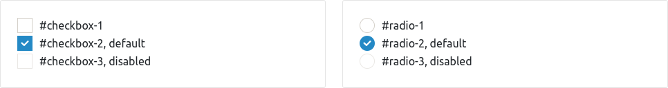

# react-ui-icheck

[![npm package]](https://www.npmjs.com/package/react-ui-icheck)
[![CI]](https://github.com/victorpopkov/react-ui-icheck/actions/workflows/ci.yml)
[![Codecov]](https://codecov.io/gh/victorpopkov/react-ui-icheck)
[![Code Climate]](https://codeclimate.com/github/victorpopkov/react-ui-icheck)
[![Libraries.io]](https://libraries.io/github/codedsolar/slack-action)

iCheck customizable checkboxes and radios built with React.

- [Overview](#overview)
- [Demo](#demo)
- [Installation](#installation)

## Overview

A small library to create customizable checkboxes and radios which can either
use [iCheck] skins or custom ones.



This library has been originally intended to be a [luqin/react-icheck] fork.
But, after diving into the original code it became more convenient to create a
new one as a drop-in replacement with some additional changes:

- Added `onBlur` and `onFocus` label events to accompany `onMouseOut` and `onMouseOver`
- Added support for labels as `Checkbox` and `Radio` children
- Introduced `CheckboxGroup` similar to the `RadioGroup`
- Introduced `labelTag` and `labelTagClassName` properties for `Checkbox` and `Radio`
- Introduced `radioWrapClassName` and `radioWrapTag` properties for `RadioGroup`
- Moved corresponding properties from `EnchantedSwitch` to `Checkbox` and `Radio`
- Removed `EnchantedSwitch` in favour of `Input` and `Label`
- Removed `refs` usage to follow the "[Don't Overuse Refs](https://reactjs.org/docs/refs-and-the-dom.html#dont-overuse-refs)" guide

## Demo

The demo can be found on the [website] alongside with the source
[here](https://github.com/victorpopkov/react-ui-icheck-website).

## Installation

The library can be installed like any other [npm] package.

If you are planning to use your custom skin(s):

```bash
$ npm install react-ui-icheck --save
# or
$ yarn add react-ui-icheck
```

However, if you are planning to use [iCheck] skin(s) you will need to install
the `icheck` package as well:

```bash
$ npm install react-ui-icheck icheck --save
# or
$ yarn add react-ui-icheck icheck
```

## License

Released under the [MIT License](https://opensource.org/licenses/MIT).

[ci]: https://img.shields.io/github/actions/workflow/status/victorpopkov/react-ui-icheck/ci.yml?branch=main&label=ci
[code climate]: https://img.shields.io/codeclimate/maintainability/victorpopkov/react-ui-icheck
[codecov]: https://img.shields.io/codecov/c/github/victorpopkov/react-ui-icheck
[icheck]: http://icheck.fronteed.com/
[libraries.io]: https://img.shields.io/librariesio/github/victorpopkov/react-ui-icheck
[luqin/react-icheck]: https://github.com/luqin/react-icheck
[luqin]: https://github.com/luqin
[npm package]: https://img.shields.io/npm/v/react-ui-icheck
[npm]: https://www.npmjs.com/
[website]: http://github.victorpopkov.com/react-ui-icheck/
